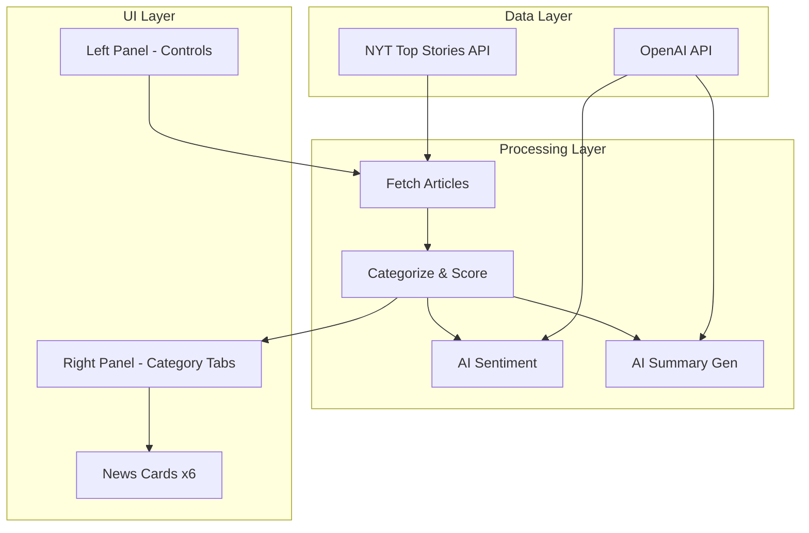
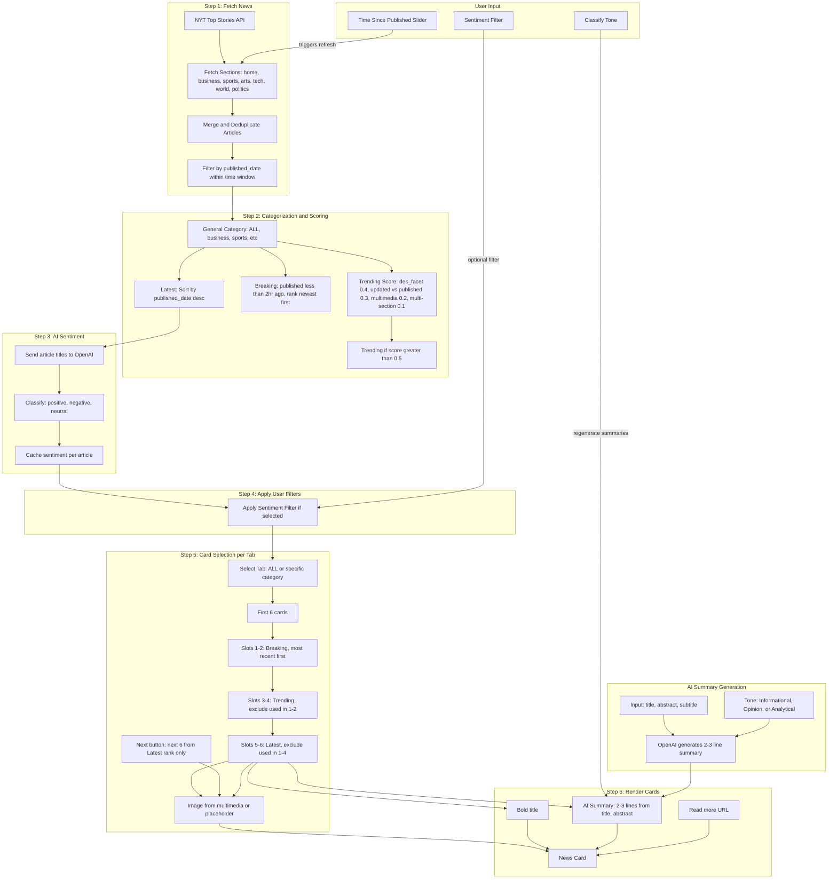

# News for People in Hurry - Shiny App Plan

## Architecture Overview



---

## Detailed Workflow Diagram



### Workflow Phases Summary

```mermaid
flowchart LR
    subgraph Phase1 [Phase 1: Data]
        A1[User sets time range]
        A2[Fetch NYT sections]
        A3[Filter by time]
        A1 --> A2 --> A3
    end

    subgraph Phase2 [Phase 2: Enrich]
        B1[General categories]
        B2[Breaking tag]
        B3[Trending score]
        B4[AI sentiment]
        A3 --> B1
        B1 --> B2 --> B3 --> B4
    end

    subgraph Phase3 [Phase 3: Filter]
        C1[Apply sentiment filter]
        C2[Select category tab]
        B4 --> C1 --> C2
    end

    subgraph Phase4 [Phase 4: Display]
        D1[First page: 2 breaking, 2 trending, 2 latest]
        D2[Render cards with image, title, AI summary, link]
        D3[Next page: continue with Latest rank only]
        C2 --> D1 --> D2 --> D3
    end
```




---

## 1. Project Structure

```
AppV1/
├── buildplan.md          # This file
├── app.R                 # Main Shiny app (or ui.R + server.R)
├── global.R              # Shared vars, API keys from env
├── modules/
│   ├── data_fetch.R      # NYT API fetching
│   ├── categorization.R  # Breaking, trending, latest logic
│   ├── ai_services.R     # OpenAI sentiment + summary
│   └── news_cards.R      # Card UI module
├── www/
│   └── placeholder.png   # Fallback when no multimedia
├── .Renviron             # NYT_API_KEY, OPENAI_API_KEY (gitignored)
├── renv.lock             # Package lock (optional)
└── README.md
```

---

## 2. NYT API Integration

**Endpoint:** `https://api.nytimes.com/svc/topstories/v2/{section}.json?api-key={key}`

**Sections to fetch** (for category tabs): `home`, `business`, `sports`, `arts`, `technology`, `world`, `politics`, etc. (align with tabs)

**Relevant Article fields:**


| Field                                | Use                                                            |
| ------------------------------------ | -------------------------------------------------------------- |
| `title`, `abstract`, `url`, `byline` | Display + summary input                                        |
| `published_date`, `updated_date`     | Breaking (<2hr), Trending (updated vs published)               |
| `des_facet`                          | Trending score (count shared facets across articles)           |
| `multimedia`                         | Card image; use `mediumThreeByTwo210` or `Normal` if available |
| `section`, `subsection`              | General category (ALL, business, sports, …)                    |


**Time filter:** Filter `published_date` by user-selected window (6–48 hrs). Re-fetch is not strictly required if we cache a broader dataset; we can filter client-side. If you prefer full re-fetch, we can add that.

---

## 3. Categorization and Scoring Logic

### 3.1 General Category

- Map API `section` to tabs: **ALL** (default), business, sports, arts, technology, world, politics, etc.
- One article can appear in multiple tabs via `section`/`subsection`.

### 3.2 Latest

- Sort by `published_date` descending.

### 3.3 Breaking

- `published_date` within last 2 hours → tag as breaking.
- Rank breaking items by most recent first.

### 3.4 Trending Score


| Signal               | Weight | Calculation                                           |
| -------------------- | ------ | ----------------------------------------------------- |
| Shared des_facet     | 0.4    | Count articles sharing ≥1 des_facet; normalize to 0–1 |
| Updated vs published | 0.3    | 1 if `updated_date` != `published_date`, else 0       |
| Has multimedia       | 0.2    | 1 if `length(multimedia) > 0`, else 0                 |
| Multiple sections    | 0.1    | 1 if article appears in ≥2 section responses, else 0  |


**Trending:** Score > 0.5 → label as trending. Rank by score desc.

### 3.5 Sentiment

- Send `title` (and optionally abstract) to OpenAI.
- Classify as: positive, negative, neutral.
- Cache per article; re-run only when articles change.

---

## 4. Card Selection and Pagination (per category tab)

**First 6 cards (prioritized):**

1. Slots 1–2: Breaking (if available), most recent first.
2. Slots 3–4: Trending (if available), most trending first; exclude already used in 1–2.
3. Slots 5–6: Latest (newest first); exclude already used in 1–4.

**Pagination (Next button):** Subsequent pages do **not** repeat the breaking/trending rule. Instead, they continue with the Latest rank—the next 6 articles in chronological order (newest to oldest) from those not yet displayed.

---

## 5. Card Display

- **Image:** First suitable `multimedia` entry (e.g. `mediumThreeByTwo210` or `Normal`), else `www/placeholder.png`.
- **Title:** Bold.
- **Summary:** AI-generated 2–3 lines from title + abstract (and subtitle if present). Default tone: Informational; user can switch to Opinion or Analytical via Classify Tone.
- **Link:** "Read more" → article `url`.

---

## 6. User Controls (Left Panel, 1/4 width)


| Control                  | Behavior                                                                                                      |
| ------------------------ | ------------------------------------------------------------------------------------------------------------- |
| **Time since published** | Slider: 6–48 hrs (default 6–24). Filter articles by `published_date`. Optionally trigger re-fetch if desired. |
| **Sentiment**            | Filter by positive / negative / neutral. Default: unselected (show all).                                      |
| **Classify Tone**        | Informational (default), Opinion, Analytical. Regenerate summaries with chosen tone for visible articles.     |


---

## 7. Layout

```mermaid
flowchart LR
    subgraph Left [1/4 - Controls]
        Time[Time Slider]
        Sentiment[Sentiment Filter]
        Tone[Tone Selector]
    end

    subgraph Right [3/4 - News]
        Tabs[ALL | business | sports | ...]
        Cards[6 Cards + Next]
    end

    Left --> Right
```


- Use `fluidPage` + `column(width = 3, ...)` and `column(width = 9, ...)` or similar grid.
- Tabs: `tabsetPanel` with `tabPanel("ALL", ...)` as `selected = TRUE`.

---

## 8. Dependencies and Configuration

**R packages:**

- `shiny` – app
- `httr`, `jsonlite` – NYT and OpenAI API calls
- `lubridate` – date parsing and time windows
- `dplyr`, `tidyr` – data processing
- `TheOpenAIR` or `httr` for OpenAI (sentiment + summary)

**Environment:**

- `NYT_API_KEY` – from `.Renviron` or `.env`
- `OPENAI_API_KEY` – for sentiment and summary
- `.Renviron` (or `.env`) should be in `.gitignore`; document keys in README.

---

## 9. Implementation Order

1. Create `AppV1` folder structure.
2. Implement `data_fetch.R`: fetch from multiple sections, parse, filter by time window.
3. Implement `categorization.R`: general categories, breaking, trending, latest.
4. Implement `ai_services.R`: sentiment and summary with tone.
5. Build `news_cards.R` module and card selection logic.
6. Build main `app.R` with layout, controls, tabs, pagination.
7. Add placeholder image and wire all pieces.
8. Test, tune caching, and document setup.

---

## 10. Open Questions

- **AI provider:** OpenAI only, or also support Anthropic/others?
- **Caching:** Cache NYT responses (e.g. 15–30 min) to reduce API usage?
- **Section list:** Exact sections for tabs (e.g. home, business, sports, arts, technology, world, politics)? We can default to a standard set and make it configurable.
