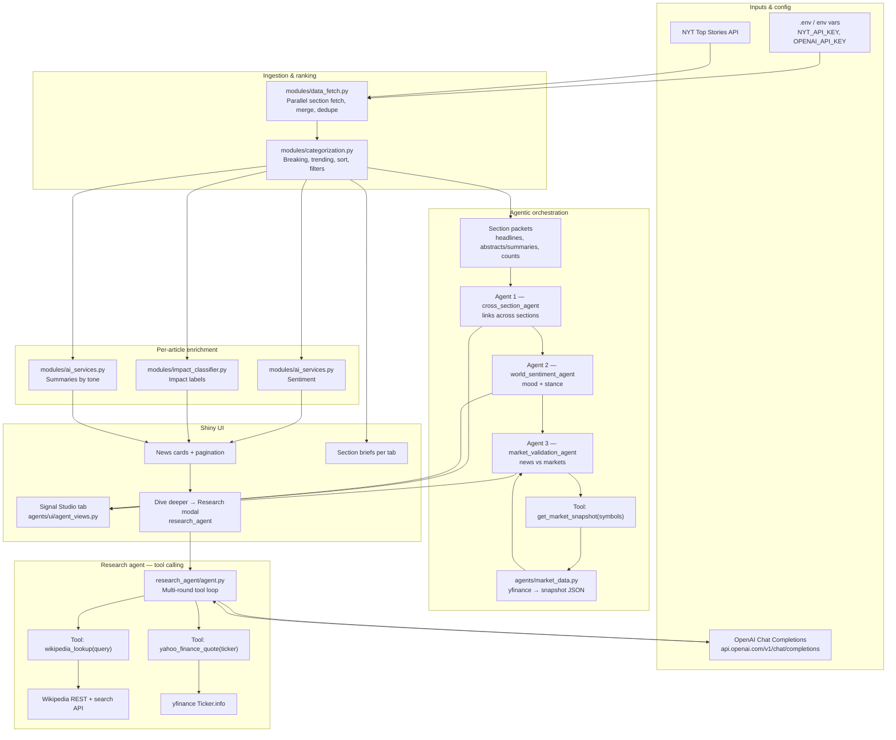

# Process diagram and technical documentation

## Process — data flow (Mermaid)

The diagram below shows how articles enter the app, how enrichment and the multi-agent workflow run, and where tool calling connects to Wikipedia, Yahoo Finance, and market snapshots.



---

## Technical documentation

### System architecture

| Piece | Role | Interaction |
|--------|------|----------------|
| **`app.py`** | Shiny server: reactive state, refresh, pagination, arms agent pipeline after first paint | Calls `modules/*`, `agents/workflow.py`, `research_agent` |
| **`config.py`** | Loads `.env` from cwd and parents; exposes keys and `NYT_SECTIONS`, `OPENAI_MODEL` | Read by all network modules |
| **`modules/data_fetch.py`** | NYT HTTP client, short-lived cache on failure | Returns `pandas` DataFrame of articles |
| **`modules/categorization.py`** | Breaking/trending heuristics, category and time filters, card selection | Pure DataFrame transforms |
| **`modules/ai_services.py`** | OpenAI calls for sentiment and summaries | Bearer `OPENAI_API_KEY` |
| **`modules/impact_classifier.py`** | OpenAI batch impact labels | Bearer `OPENAI_API_KEY` |
| **`agents/workflow.py`** | Orchestrates `generate_section_briefs` then `run_multi_agent_workflow` | Agent 1 → 2 → 3; prefetches `fetch_market_snapshot()` |
| **Signal Studio UX** | `ui/agent_views.py` renders workflow JSON and section payloads | Driven by `agent_workflow_state` in `app.py` |

**Workflow (high level):** Section packets (per-tab context plus sentiment/impact counts) feed **Agent 1** (`cross_section_agent`) for cross-section links. **Agent 2** (`world_sentiment_agent`) consumes Agent 1 plus the same packets to produce mood and stance. **Agent 3** (`market_validation_agent`) compares Agent 2 to markets; it uses **`get_market_snapshot`** when the OpenAI tool path succeeds, otherwise JSON mode with a prefetched snapshot from `fetch_market_snapshot()`.

The UI uses a **quick-then-full** pattern: deterministic placeholders and a fast workflow snapshot render first; a background pass replaces them with LLM-generated section briefs and the full three-agent result when complete.

---

### RAG / tool implementation

**Research assistant (tool calling, RAG-style grounding)**

| Tool name | Purpose | Parameters | Returns |
|-----------|---------|------------|---------|
| `wikipedia_lookup` | Ground entities in English Wikipedia | `query` (string, required); `max_extract_chars` (int, optional, default 1500) | Plain text: resolved title + truncated extract, or error string |
| `yahoo_finance_quote` | Optional market context for clearly market-related stories | `ticker` (string, required) | Plain text JSON subset of `yfinance` `info` (price, name, change, etc.) or error |

Implementation: `research_agent/tools.py` (`wikipedia_lookup`, `yahoo_finance_quote`, `dispatch_tool`). The agent loop is in `research_agent/agent.py` (`run_research_brief`): posts to Chat Completions with `tools`, handles `tool_calls`, appends `role: tool` messages, max rounds 6. Results are cached per article URL in `research_agent/brief_cache.py`. Wikipedia responses are cached in-process (24h); Yahoo tool results (15m).

**Signal Studio — market tool**

| Tool name | Purpose | Parameters | Returns |
|-----------|---------|------------|---------|
| `get_market_snapshot` | Let the model request a fresh subset of market symbols | `symbols` (array of strings, required) | JSON string of snapshot dict from `fetch_market_snapshot(symbols)` |

Implementation: `agents/market_validation_agent.py` (`_execute_get_market_snapshot` → `agents/market_data.py`). Default universe includes `^GSPC`, `^IXIC`, `^DJI`, `GC=F`, `CL=F`, `BTC-USD` with a 10-minute cache when no symbol list is passed.

**Note:** There is no separate vector database; “RAG” here means **retrieval at request time** from Wikipedia and Yahoo endpoints (plus structured market history from `yfinance` in `market_data.py`).

---

### Technical details

**API keys (environment / `.env`)**

- `NYT_API_KEY` — NYT Top Stories.
- `OPENAI_API_KEY` — Chat Completions for sentiment, summaries, impact, section briefs, all three workflow agents, and the research agent.

Never commit real keys; use platform secret managers in deployment.

**Representative endpoints**

- NYT: `https://api.nytimes.com/svc/topstories/v2/{section}.json?api-key=...`
- OpenAI: `https://api.openai.com/v1/chat/completions`
- Wikipedia: `https://en.wikipedia.org/w/api.php` (search), `https://en.wikipedia.org/api/rest_v1/page/summary/{title}` (extract)

**Packages** (from `requirements.txt`): `shiny`, `httpx`, `python-dotenv`, `pandas`, `uvicorn[standard]`, `yfinance`.

**File structure (focused)**

```
AppV1/
├── app.py                 # Shiny app + server logic
├── config.py              # Keys, model id, NYT sections
├── Procfile               # web process (uvicorn when ASGI entry is used)
├── requirements.txt
├── agents/                # Multi-agent workflow + LLM client + market_data
├── modules/               # NYT fetch, categorization, OpenAI helpers, cards
├── research_agent/        # Tool-calling research brief + tools + cache
├── ui/                    # layout, Signal Studio / marquee views
└── www/                   # styles.css, static assets
```

**Deployment platform:** The repo includes a **`Procfile`** intended for platforms like Heroku-style hosts: `uvicorn app:app --host 0.0.0.0 --port ${PORT:-8080}` when run with `AppV1` as the working directory (Shiny’s `App` object is ASGI-compatible in recent `shiny` versions). Local development is typically `shiny run app.py` from `AppV1` or `shiny run AppV1/app.py` from the repo root; see `SETUP_ENV.md` and the main `README.md`.
