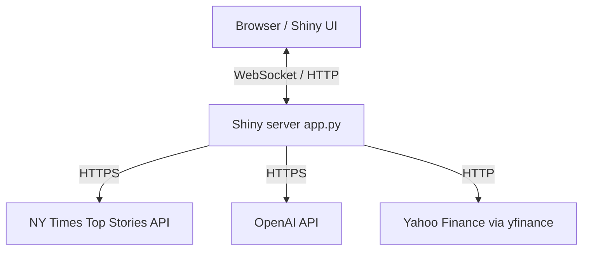
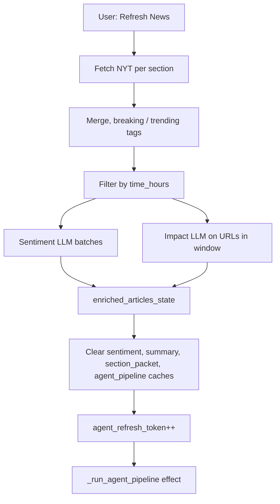
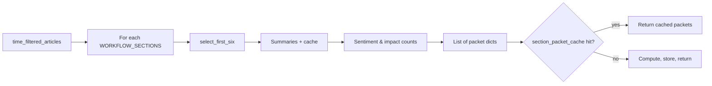
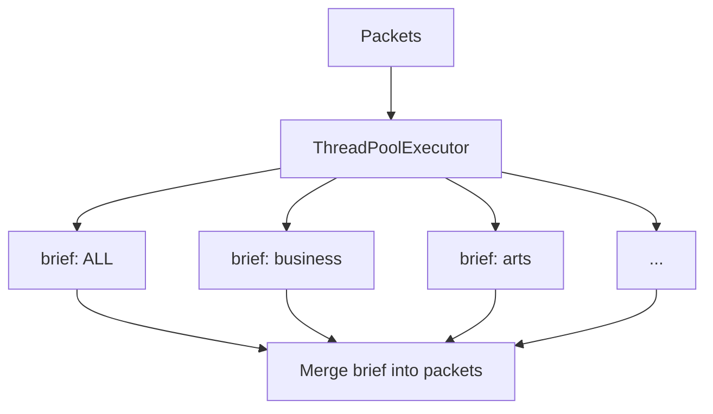
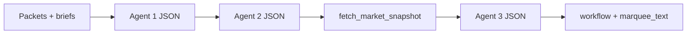
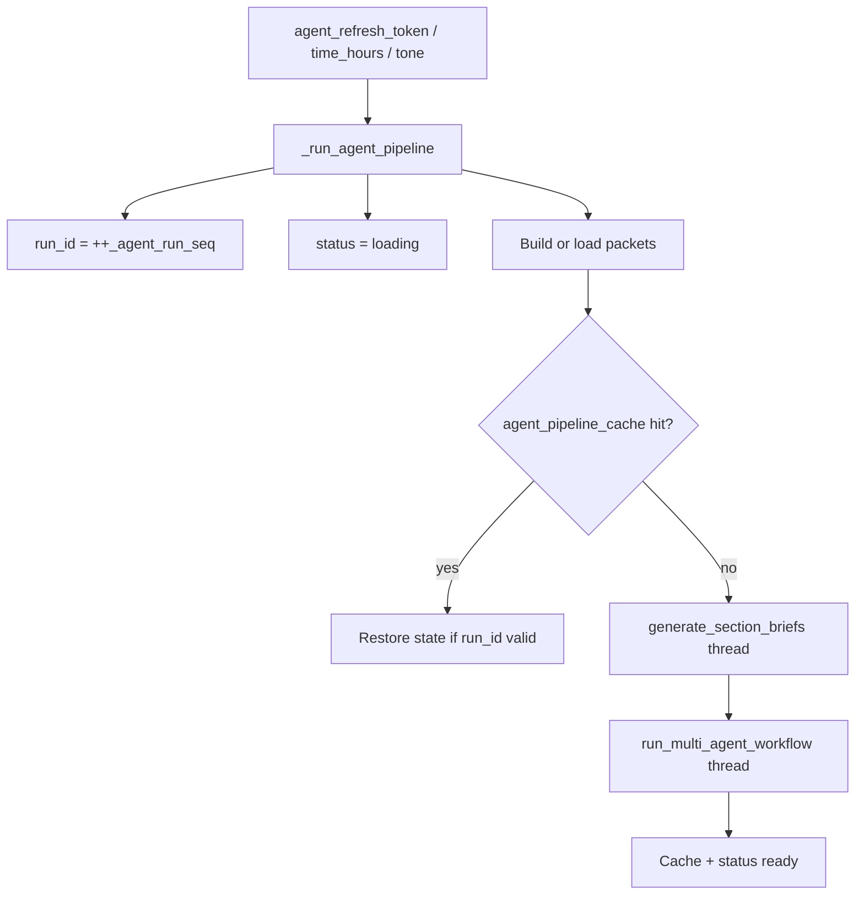
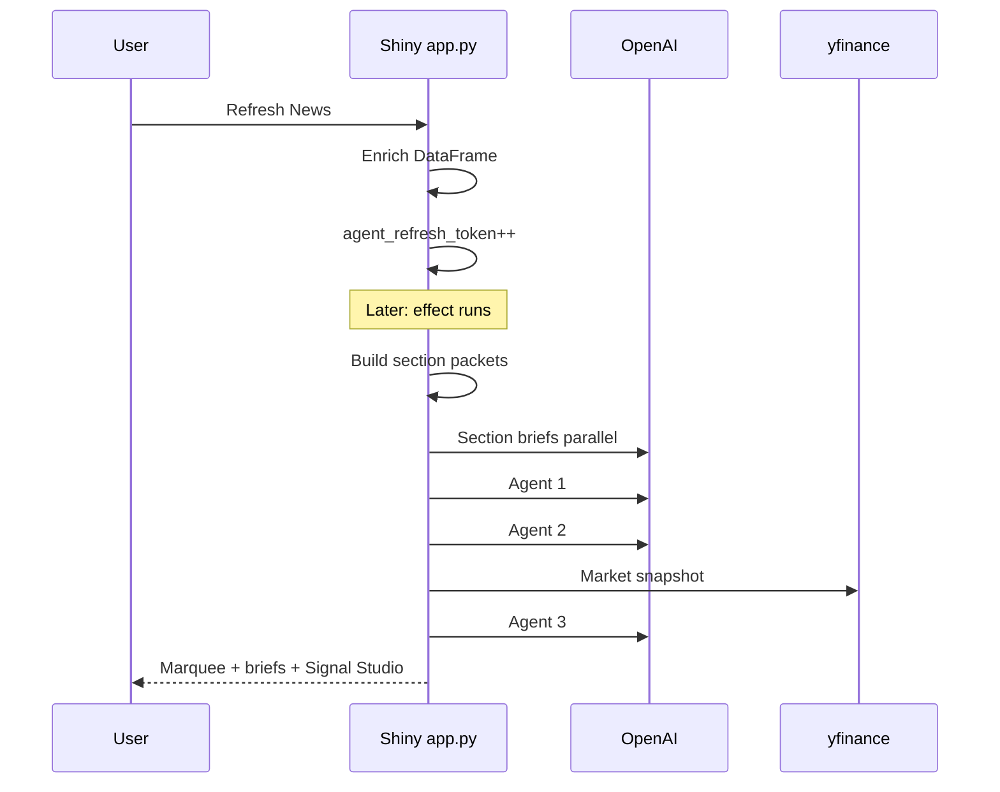
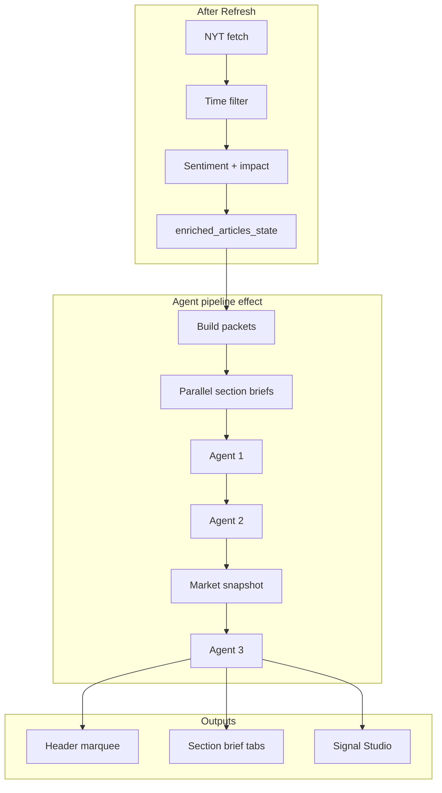
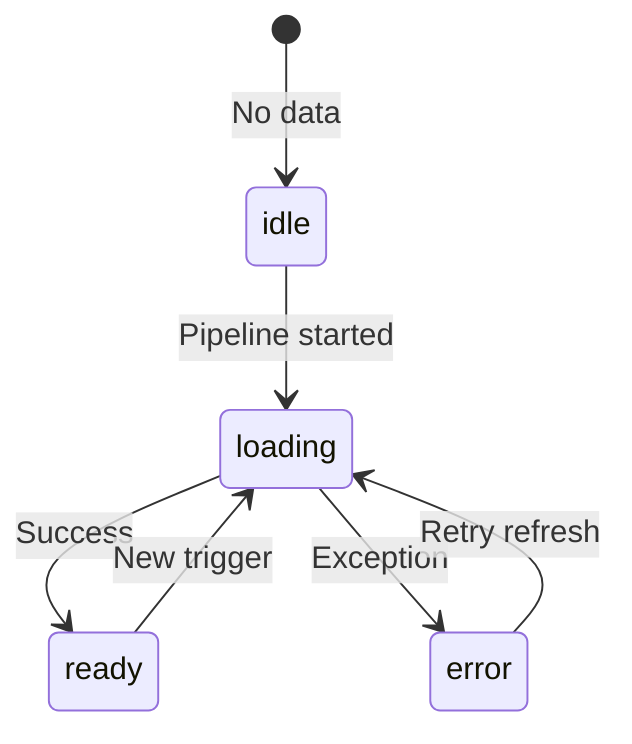
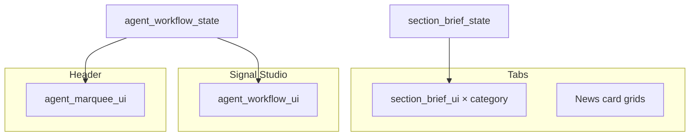

# AppV1 Multi-Agent News Intelligence — Technical Architecture

> **Document version:** 1.2.3  
> **Last updated:** 2026-04-11  
> **See also:** [`VERSION.md`](./VERSION.md) · [`AppV1/AGENTS.md`](../AppV1/AGENTS.md) (agent prompts & tool summary)

This README describes the **current** AppV1 implementation: NYT ingestion, enrichment, the `agents/` multi-agent pipeline, Shiny reactivity, caching, and UI (Global Insight marquee, section briefs, Signal Studio). Diagrams use [Mermaid](https://mermaid.js.org/) and render on GitHub, GitLab, and many Markdown viewers.

---

## Agentic orchestration (multi-agent & tool use)

This section summarizes how AppV1 combines **coordinated agents** with clear roles, **workflow integration**, and how outputs reach the UI.

### Multi-agent system (2–3 agents)

The primary pipeline uses **three LLM agents** in series, after **parallel** per-section briefs:

| Step | Role |
|------|------|
| Section briefs (parallel) | Short LLM text per section packet (`section_brief_agent.py`). |
| **Agent 1** | Cross-section analysis: links, triggers, propagation across desks (`cross_section_agent.py`). |
| **Agent 2** | World mood, score, and market stance from Agent 1 + sentiment counts (`world_sentiment_agent.py`). |
| **Market snapshot** | Yahoo Finance aggregation via `yfinance` (`market_data.py`) — data layer, not an LLM. |
| **Agent 3** | Compares news narrative to the market tape: agreement, insight, marquee-ready copy (`market_validation_agent.py`). |

Agents **1 → 2 → 3** run **sequentially**; each stage consumes structured outputs from the previous stage plus shared **section packets**, so the workflow behaves as a single orchestrated chain toward a **Global Insight** narrative and **Signal Studio** dashboard.

### Clear roles and system prompts

Each agent module defines one **`AGENT_SYSTEM_PROMPT`** (role instructions) and one main entry function. Prompt text is centralized per file; see **[`AppV1/AGENTS.md`](../AppV1/AGENTS.md)** for a one-line summary per agent.

### Coordination and workflow goals

**`run_multi_agent_workflow`** (`agents/workflow.py`) filters packets, runs Agent 1 → Agent 2, prefetches **`fetch_market_snapshot()`** for UI/fallback, then runs Agent 3. The returned dict (`agent1`, `agent2`, `agent3`, `market_snapshot`, `marquee_text`) is the single contract the Shiny server caches and maps to UI.

### Integration into the application

Agent outputs drive **user-visible behavior**: the header **Global Insight** marquee (`marquee_text` from Agent 3), **per-tab section briefs**, **Signal Studio** panels (full JSON for agents 1–3, market pulse, confidence styling), and cached **agent pipeline** state so refreshes stay fast and consistent.

---

## Table of contents

1. [Agentic orchestration (multi-agent & tool use)](#agentic-orchestration-multi-agent--tool-use)
2. [Overview](#1-overview)
3. [System context](#2-system-context)
4. [Runtime stack](#3-runtime-stack)
5. [End-to-end lifecycle](#4-end-to-end-lifecycle)
6. [Section packets](#5-section-packets)
7. [Section briefs (parallel)](#6-section-briefs-parallel-llm-phase)
8. [Multi-agent workflow (serial)](#7-multi-agent-workflow-serial)
9. [LLM client layer](#8-llm-client-layer)
10. [Market data](#9-market-data)
11. [Shiny reactive pipeline](#10-shiny-reactive-pipeline)
12. [UI state machine](#11-ui-state-machine)
13. [Data shapes](#12-data-shapes)
14. [UI mapping](#13-ui-mapping)
15. [Caching](#14-caching)
16. [Module reference](#15-module-reference)
17. [Operational notes](#16-operational-notes)
18. [Diagram index](#17-diagram-index)
19. [Document changelog](#18-document-changelog)
20. [Related documentation](#19-related-documentation)

---

## 1. Overview

**News for People in Hurry** (`AppV1/app.py`) is a Shiny for Python application that:

1. Fetches **New York Times** Top Stories (multiple sections).
2. Computes **breaking / trending / latest** ordering and filters by a **time window** (6–48 hours).
3. Enriches rows with **sentiment** and **impact** labels via **OpenAI**.
4. Builds **section packets** (headlines, summaries, counts) for six logical sections plus ALL.
5. Runs **parallel section briefs** (short LLM text per packet).
6. Runs a **serial three-agent workflow** (cross-section analysis → world mood → **Yahoo Finance** snapshot → market validation).
7. Renders **Global Insight** (header marquee), **per-tab section briefs**, and **Signal Studio** (full dashboard).

External dependencies: **NYT API**, **OpenAI API**, **yfinance** (Yahoo Finance).

---

## 2. System context

---

## 3. Runtime stack

| Layer | Technology |
|-------|------------|
| App server | Shiny for Python, uvicorn ASGI |
| Data | `pandas.DataFrame` for articles |
| Reactivity | `reactive.value`, `reactive.calc`, `reactive.effect` |
| Config | `python-dotenv`; keys in `config.py` (`NYT_API_KEY`, `OPENAI_API_KEY`) |
| Agents | Package `AppV1/agents/`; long calls via `asyncio.to_thread` |
| HTTP client | `httpx` (shared client in `llm_client.py`) |

---

## 4. End-to-end lifecycle

After the user clicks **Refresh News**, the server fetches articles, merges sections, applies `filter_by_time`, runs sentiment in batches and scoped impact classification, writes **`enriched_articles_state`**, then increments **`agent_refresh_token`**, which triggers the agent pipeline (Section 10).

---

## 5. Section packets

Function **`_build_agent_section_packets`** (`app.py`) uses **`time_filtered_articles()`** (enriched DataFrame).

- **`WORKFLOW_SECTIONS`**: `ALL`, `business`, `arts`, `technology`, `world`, `politics` (see `agents/workflow.py`).
- For each section: **`select_first_six`** rows (for `ALL`, uses full filtered set as the section filter allows).
- Per row: titles, URLs, **`_ensure_summaries_for_articles`** (tone from sidebar; **`summary_cache`** key `url|tone`).
- **`_normalized_counts`** on sentiment and `impact_label` for the six cards.
- **Cache:** SHA-256 key over tone, `time_hours`, and stable row fingerprints → **`section_packet_cache`**.

---

## 6. Section briefs (parallel LLM phase)

- **`generate_section_briefs`** → **`build_section_briefs`** (`section_brief_agent.py`).
- **`ThreadPoolExecutor`**: `max_workers = min(4, len(section_packets))`.
- Each worker calls **`build_section_brief`** → **`call_text_llm`**.
- Output: `dict[section_id, brief_text]`; app merges **`brief`** into each packet before the multi-agent chain.

---

## 7. Multi-agent workflow (serial)

**`run_multi_agent_workflow`** (`agents/workflow.py`):

1. Filter packets to **`AGENT_ANALYSIS_SECTIONS`** (excludes **`ALL`**).
2. **Agent 1** — `analyze_cross_section_links` → JSON (`cross_section_summary`, `connections`, …).
3. **Agent 2** — `evaluate_world_sentiment(agent1, packets)` → mood score, label, description, reasoning.
4. **Market** — `fetch_market_snapshot()` (not an LLM).
5. **Agent 3** — `validate_with_markets(agent1, agent2, snapshot)` → agreement, `final_insight`, `marquee_text`, etc. Agent 3’s **first** LLM turn may use OpenAI **tool calling** (`get_market_snapshot` → `fetch_market_snapshot(symbols)`); the **second** turn requests JSON. If no tool path succeeds, Agent 3 uses **`call_json_llm`** with the **prefetched** snapshot (same contract as before).

Agents **1 → 2 → 3** are strictly **sequential**; only section briefs are parallel across sections.

---

## 8. LLM client layer

**`agents/llm_client.py`**

- Shared **`httpx.Client`** (timeout ~45s).
- **`call_text_llm`** — Chat Completions; used for section briefs.
- **`call_json_llm`** — Chat Completions with **`response_format: json_object`**; **`_extract_json_object`** strips / parses; agents supply **fallback dicts** on failure.
- **`run_tool_round_then_json`** — First completion with **`tools`** + **`tool_choice: "auto"`** (no JSON schema on round 1); if the assistant emits **`tool_calls`**, the app appends **`tool`** messages and runs a **second** completion with **`response_format: json_object`**. Used by Agent 3 for **`get_market_snapshot`**. If round 1 has no tools, parses JSON from assistant **content** when valid; otherwise returns **`None`** so the caller can fall back to **`call_json_llm`**.
- Model id: **`config.OPENAI_MODEL`**.

---

## 9. Market data

**`agents/market_data.py`**

- Symbols: `^GSPC`, `^IXIC`, `^DJI`, `GC=F`, `CL=F`, `BTC-USD` (labels in `MARKET_TICKERS`).
- **`fetch_market_snapshot()`** (no args): full **`MARKET_TICKERS`** set; 5-day history per symbol; `%` change vs prior close; **`MARKET_CACHE_TTL`** (~10 minutes) in-process cache.
- **`fetch_market_snapshot(symbols)`** (non-`None` list): same payload shape for **only** those tickers; **does not** read/write the global cache (used when Agent 3’s tool supplies symbol lists).
- Heuristic **`market_bias`**: bullish / bearish / mixed / unknown; **`avg_change`**, leaders/laggards.

---

## 10. Shiny reactive pipeline

**Effect:** `_run_agent_pipeline`  
**Triggers:** `@reactive.event(agent_refresh_token, input.time_hours, input.tone)`

- **`_agent_run_seq`**: monotonic id; after each `await`, if `run_id != _agent_run_seq[0]`, result is discarded (stale run).
- Loads packets → checks **`agent_pipeline_cache`** (key includes tone, hours, full packets).
- **Cache hit:** restore **`section_brief_state`** and **`agent_workflow_state`**.
- **Cache miss:** `asyncio.to_thread(generate_section_briefs)` → merge briefs → `asyncio.to_thread(run_multi_agent_workflow)` → save caches.
- **Exception:** `agent_workflow_state.status = error`.

### Full pipeline (stacked)

---

## 11. UI state machine

**`agent_workflow_state`** (conceptual):

| `status` | User sees |
|----------|-----------|
| `idle` | Prompt to refresh |
| `loading` | “Signal Studio is running…” |
| `ready` | Full dashboard + marquee |
| `error` | Fallback message |

---

## 12. Data shapes

### Section packet (after brief merge)

| Field | Type | Notes |
|-------|------|--------|
| `section` | str | e.g. `business` |
| `label` | str | Display name |
| `headlines` | list[str] | From first six cards |
| `article_summaries` | list[str] | Tone-aware |
| `sentiment_counts` | dict | `positive`, `negative`, `neutral` |
| `impact_counts` | dict | Same keys |
| `urls` | list[str] | |
| `brief` | str | After `generate_section_briefs` |

### `agent_workflow_state`

| Key | Description |
|-----|-------------|
| `status` | `idle` \| `loading` \| `ready` \| `error` |
| `marquee_text` | String for ticker / insight |
| `workflow` | `agent1`, `agent2`, `agent3`, `market_snapshot`, `generated_at` |
| `sections` | List of merged packets with briefs |

### `section_brief_state`

`dict[section_id, brief_text]` for **section brief** UI on each tab.

---

## 13. UI mapping

| Component | Source | Module |
|-----------|--------|--------|
| Global Insight marquee | `agent_workflow_state` → `_insight_slides` | `agent_marquee_ui` |
| Section brief card | `section_brief_state` + counts from articles | `section_brief_ui` |
| Signal Studio | `agent_workflow_state` + `input.agent_view_mode` | `agent_workflow_ui` |
| Header layout | `app_header_with_marquee` | `layout.py` |

---

## 14. Caching

| Cache | Key / invalidation | Purpose |
|-------|-------------------|---------|
| `sentiment_cache` | Cleared on Refresh | URL → sentiment |
| `summary_cache` | Cleared on Refresh | `url\|tone` → summary |
| `section_packet_cache` | Cleared on Refresh; key = SHA of tone + hours + row fingerprints | Packet list |
| `agent_pipeline_cache` | Cleared on Refresh; key = tone + hours + packets payload | Full pipeline result |
| Market snapshot | TTL ~10 min in `market_data.py` | yfinance aggregation |

---

## 15. Module reference

| Path | Role |
|------|------|
| `AppV1/app.py` | Shiny UI, server, enrichment, `_run_agent_pipeline`, caches |
| `AppV1/agents/workflow.py` | `generate_section_briefs`, `run_multi_agent_workflow`, constants |
| `AppV1/agents/llm_client.py` | OpenAI text/JSON helpers; **`run_tool_round_then_json`** for Agent 3 tool loop |
| `AppV1/agents/section_brief_agent.py` | Section briefs + executor |
| `AppV1/agents/cross_section_agent.py` | Agent 1 |
| `AppV1/agents/world_sentiment_agent.py` | Agent 2 |
| `AppV1/agents/market_validation_agent.py` | Agent 3 |
| `AppV1/agents/market_data.py` | Yahoo snapshot + cache |
| `AppV1/ui/agent_views.py` | Marquee, briefs, Signal Studio, About |
| `AppV1/ui/layout.py` | Header + marquee slot, sidebar |
| `AppV1/www/styles.css` | Styles |
| `AppV1/modules/categorization.py` | Trending; optimized `des_facet` scoring |

---

## 16. Operational notes

- **NYT 429**: Rate limits may drop a section (e.g. politics); feed still loads from other sections.
- **Network**: OpenAI and yfinance failures → Signal Studio **error** or JSON **fallbacks** inside agents.
- **Confidence %** on Signal Studio: computed in **`agent_views.py`** (`_confidence_score`), not an LLM output.
- **Costs**: Each refresh can invoke many OpenAI calls (briefs + 3 agents + existing sentiment/impact/summaries).

---

## 17. Diagram index

| # | Section | Diagram type |
|---|---------|----------------|
| 2 | System context | flowchart TB |
| 4 | Refresh lifecycle | flowchart TD |
| 5 | Section packets | flowchart LR |
| 6 | Parallel briefs | flowchart TB |
| 7 | Serial agents | flowchart LR |
| 10 | Reactive + cache | flowchart TD |
| 10 | Sequence | sequenceDiagram |
| 10 | Full stacked pipeline | flowchart TB |
| 11 | UI states | stateDiagram |
| 13 | UI data flow | flowchart TB |

Render locally: paste any block into [Mermaid Live Editor](https://mermaid.live).

---

## 18. Document changelog

| Doc version | Date | Changes |
|-------------|------|---------|
| 1.0.0 | 2026-04-11 | Initial Markdown: full architecture, all Mermaid diagrams, tables. |
| 1.1.0 | 2026-04-11 | Documentation bundle metadata and cross-links. |
| 1.2.0 | 2026-04-11 | Added **Agentic orchestration** section (multi-agent roles, workflow integration, RAG vs **tool calling**); TOC renumbered; LLM layer + Agent 3 notes for **`get_market_snapshot`** / **`run_tool_round_then_json`**; link to [`AppV1/AGENTS.md`](../AppV1/AGENTS.md). |
| 1.2.1 | 2026-04-11 | Dropped extra documentation cross-links from header and Related section; retitled orchestration section. |
| 1.2.2 | 2026-04-11 | Removed rubric comparison tables file from the repository (see `docs/VERSION.md`). |
| 1.2.3 | 2026-04-11 | Removed RAG vs tool-calling comparison table from orchestration section; shortened intro. |

---

## 19. Related documentation

- **[`AppV1/AGENTS.md`](../AppV1/AGENTS.md)** — Per-agent **`AGENT_SYSTEM_PROMPT`** summary and Agent 3 tool vs workflow snapshot note.
- **[`VERSION.md`](./VERSION.md)** — Documentation bundle version for this architecture release (**1.2.3**).

---

*End of document.*
