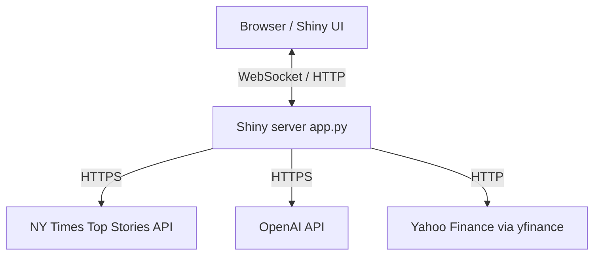
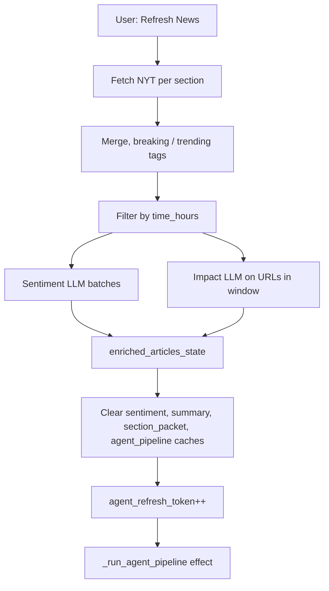
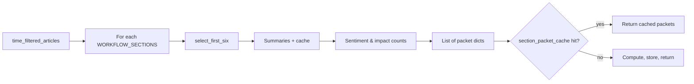
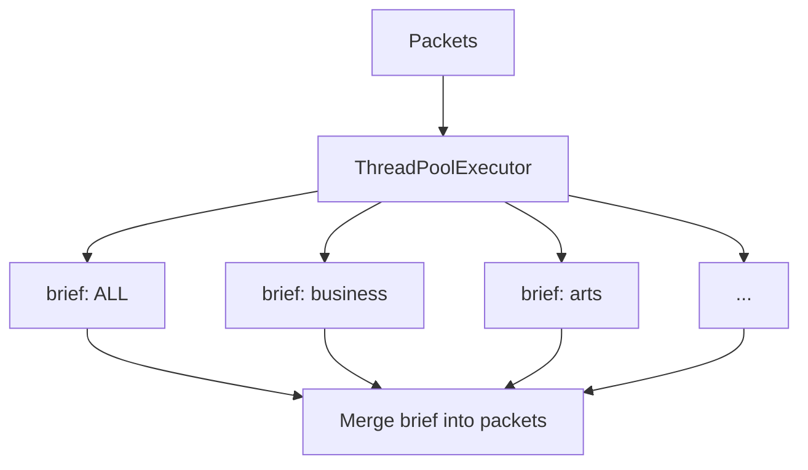
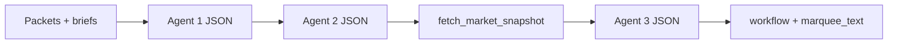
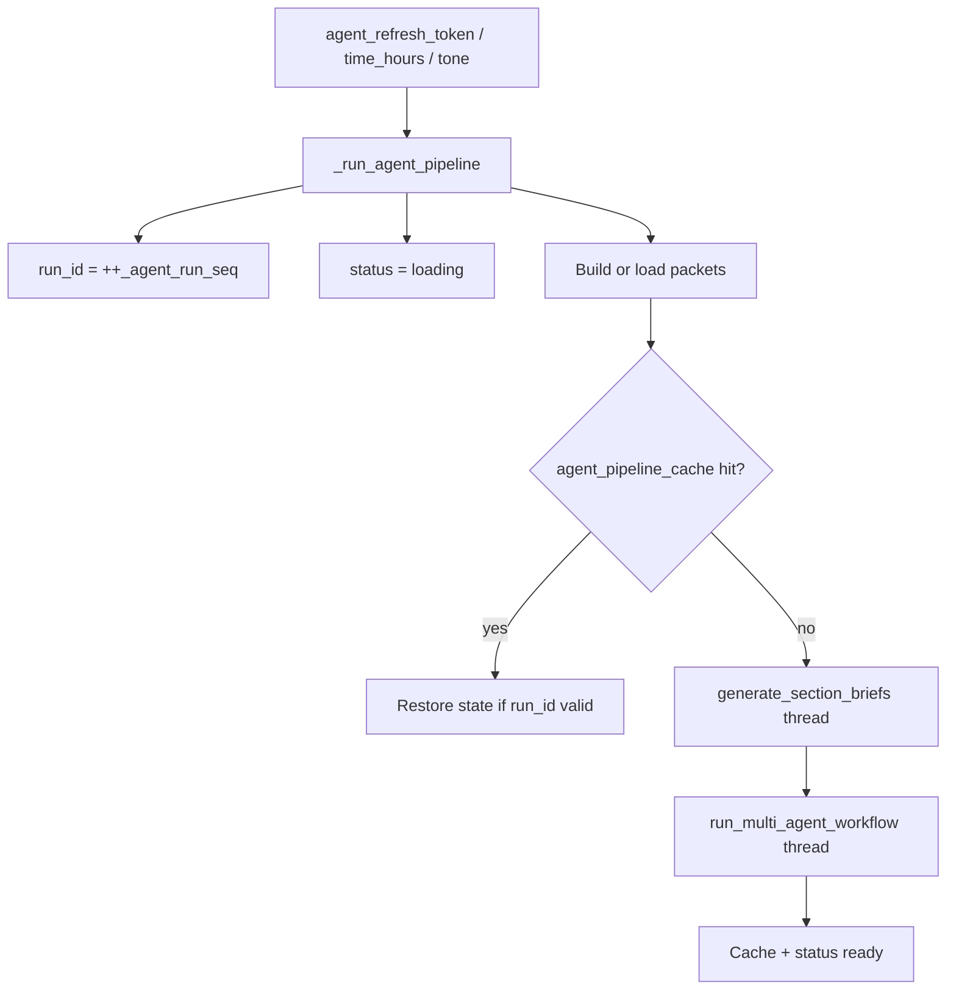
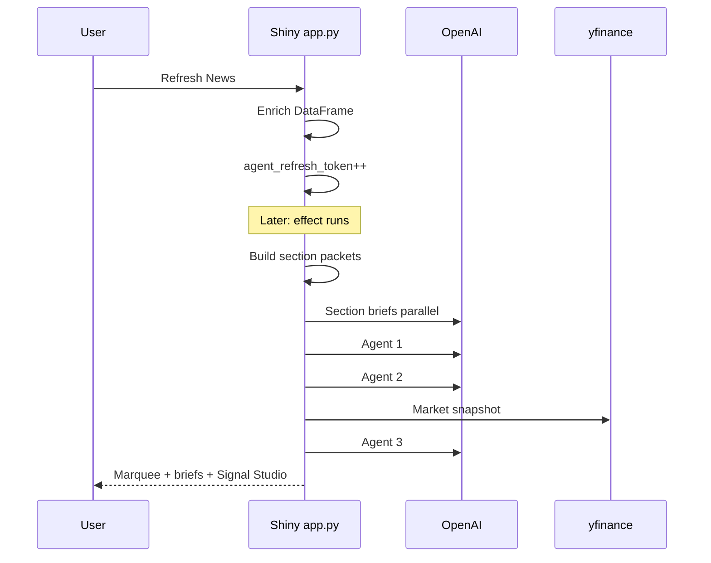
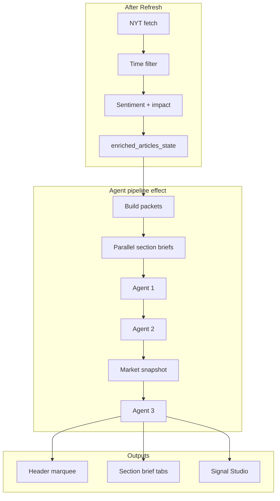
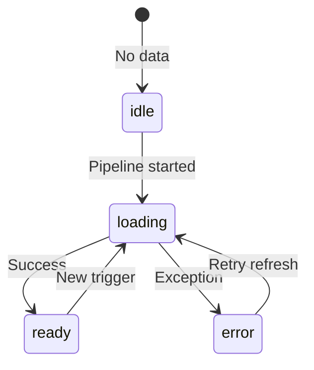
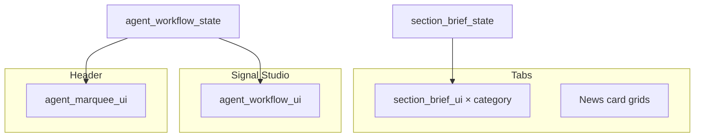

# AppV1 Multi-Agent News Intelligence — Technical Architecture

> **Document version:** 2.0.0  
> **Last updated:** 2026-04-11  
> **See also:** [`VERSION.md`](./VERSION.md) · [`AppV1/AGENTS.md`](../AppV1/AGENTS.md) (short agent prompts & tool summary)

This is the **primary reference** for AppV1: **NYT → enrichment → section packets → parallel briefs → serial three-agent workflow**, **OpenAI tool calling** (Agent 3), **Shiny** reactivity, **caching**, and the **full UI** (sidebar, tabs, Global Insight marquee, Signal Studio, research modal). It combines **Mermaid diagrams** with tables for agents, modules, and controls. Diagrams render on GitHub, GitLab, and most Markdown viewers.

---

## Agentic orchestration (multi-agent & tool use)

This section summarizes how AppV1 combines **coordinated agents** with clear roles, **workflow integration**, and how outputs reach the UI.

### Multi-agent system (2–3 agents)

The primary pipeline uses **three LLM agents** in series, after **parallel** per-section briefs:

| Step | Role |
|------|------|
| Section briefs (parallel) | Short LLM text per section packet (`section_brief_agent.py`). |
| **Agent 1** | Cross-section analysis: links, triggers, propagation across desks (`cross_section_agent.py`). |
| **Agent 2** | World mood, score, and market stance from Agent 1 + sentiment counts (`world_sentiment_agent.py`). |
| **Market snapshot** | Yahoo Finance aggregation via `yfinance` (`market_data.py`) — data layer, not an LLM. |
| **Agent 3** | Compares news narrative to the market tape: agreement, insight, marquee-ready copy (`market_validation_agent.py`). |

Agents **1 → 2 → 3** run **sequentially**; each stage consumes structured outputs from the previous stage plus shared **section packets**, so the workflow behaves as a single orchestrated chain toward a **Global Insight** narrative and **Signal Studio** dashboard.

### Clear roles and system prompts

Each agent module defines one **`AGENT_SYSTEM_PROMPT`** (role instructions) and one main entry function. Prompt text is centralized per file; see **[`AppV1/AGENTS.md`](../AppV1/AGENTS.md)** for a one-line summary per agent.

### Coordination and workflow goals

**`run_multi_agent_workflow`** (`agents/workflow.py`) filters packets, runs Agent 1 → Agent 2, prefetches **`fetch_market_snapshot()`** for UI/fallback, then runs Agent 3. The returned dict (`agent1`, `agent2`, `agent3`, `market_snapshot`, `marquee_text`) is the single contract the Shiny server caches and maps to UI.

### Integration into the application

Agent outputs drive **user-visible behavior**: the header **Global Insight** marquee (`marquee_text` from Agent 3), **per-tab section briefs**, **Signal Studio** panels (full JSON for agents 1–3, market pulse, confidence styling), and cached **agent pipeline** state so refreshes stay fast and consistent.

---

## Table of contents

Section **§4** adds an **enrichment pipeline** table; **§7** expands **per-agent roles**, **Agent 3 tool calling**, and fallbacks; **§13** is the **full UI** reference (sidebar, tabs, Signal Studio, research modal).

1. [Agentic orchestration (multi-agent & tool use)](#agentic-orchestration-multi-agent--tool-use)
2. [Overview](#1-overview)
3. [System context](#2-system-context)
4. [Runtime stack](#3-runtime-stack)
5. [End-to-end lifecycle](#4-end-to-end-lifecycle)
6. [Section packets](#5-section-packets)
7. [Section briefs (parallel)](#6-section-briefs-parallel-llm-phase)
8. [Multi-agent workflow (serial)](#7-multi-agent-workflow-serial)
9. [LLM client layer](#8-llm-client-layer)
10. [Market data](#9-market-data)
11. [Shiny reactive pipeline](#10-shiny-reactive-pipeline)
12. [UI state machine](#11-ui-state-machine)
13. [Data shapes](#12-data-shapes)
14. [UI mapping](#13-ui-mapping)
15. [Caching](#14-caching)
16. [Module reference](#15-module-reference)
17. [Operational notes](#16-operational-notes)
18. [Diagram index](#17-diagram-index)
19. [Document changelog](#18-document-changelog)
20. [Related documentation](#19-related-documentation)

---

## 1. Overview

**News for People in Hurry** (`AppV1/app.py`) is a Shiny for Python application that:

1. Fetches **New York Times** Top Stories (multiple sections).
2. Computes **breaking / trending / latest** ordering and filters by a **time window** (6–48 hours).
3. Enriches rows with **sentiment** and **impact** labels via **OpenAI**, and **AI summaries** with a user-selected **tone** (sidebar).
4. Builds **section packets** (headlines, summaries, counts) for six logical sections plus ALL.
5. Runs **parallel section briefs** (short LLM text per packet).
6. Runs a **serial three-agent workflow** (cross-section analysis → world mood → **Yahoo Finance** snapshot → market validation), with Agent 3 optionally using **function calling** (`get_market_snapshot`).
7. Renders **news cards** (with pagination), **Global Insight** (header marquee), **per-tab section briefs**, and **Signal Studio** (full agent dashboard).
8. Optionally opens a **Research brief** modal per article via `research_agent/` (separate OpenAI tool-using agent; not part of the three-agent chain).

**Stack:** Shiny for Python, pandas, httpx, python-dotenv, uvicorn, **OpenAI Chat Completions** (`config.OPENAI_MODEL`), **yfinance**.

External dependencies: **NYT API**, **OpenAI API**, **yfinance** (Yahoo Finance).

---

## 2. System context



---

## 3. Runtime stack

| Layer | Technology |
|-------|------------|
| App server | Shiny for Python, uvicorn ASGI |
| Data | `pandas.DataFrame` for articles |
| Reactivity | `reactive.value`, `reactive.calc`, `reactive.effect` |
| Config | `python-dotenv`; keys in `config.py` (`NYT_API_KEY`, `OPENAI_API_KEY`) |
| Agents | Package `AppV1/agents/`; long calls via `asyncio.to_thread` |
| HTTP client | `httpx` (shared client in `llm_client.py`) |

### Configuration (`AppV1/config.py`)

| Item | Purpose |
|------|---------|
| `.env` loading | Resolves `.env` from cwd (via python-dotenv) and by walking up from `AppV1` to the repo root so keys work regardless of launch directory. |
| `NYT_API_KEY` | NYT Top Stories API. |
| `OPENAI_API_KEY` | Sentiment, summaries, impact, section briefs, agents 1–3, research agent. |
| `OPENAI_MODEL` | Single Chat Completions model id for all of the above (e.g. `gpt-4o-mini-2024-07-18`). |
| `NYT_SECTIONS` | Sections requested from NYT: `home`, `business`, `arts`, `technology`, `world`, `politics`. |

---

## 4. End-to-end lifecycle

After the user clicks **Refresh News**, the server fetches articles, merges sections, applies `filter_by_time`, runs sentiment in batches and scoped impact classification, writes **`enriched_articles_state`**, then increments **`agent_refresh_token`**, which triggers the agent pipeline (Section 10).



### Enrichment pipeline (before section packets)

Stages run in **`app.py`** / **`modules/`** after fetch and merge:

| Stage | Location | Role |
|-------|----------|------|
| Fetch | `modules/data_fetch.fetch_nyt_articles` | HTTPS to NYT per section; merged DataFrame. |
| Time filter | `filter_by_time` | Keeps rows in the sidebar hour window. |
| Ordering / facets | `modules/categorization` | Breaking tags, trending score, latest sort; `select_first_six` / pagination helpers. |
| Sentiment | `modules/ai_services.get_sentiments_parallel` | OpenAI per URL; **`sentiment_cache`**. |
| Impact | `modules/impact_classifier.get_impacts_for_articles` | Scoped LLM labels → `impact_label`. |
| Summaries | `modules/ai_services.get_summaries_parallel` | Tone-aware summaries; **`summary_cache`** (`url|tone`). |
| Packets | `_build_agent_section_packets` in `app.py` | Builds per-section packets; **`section_packet_cache`**. |

**Refresh News** clears sentiment, summary, packet, and agent caches and bumps **`agent_refresh_token`**. Changing **time** or **tone** can also schedule a new agent run (see `_run_agent_pipeline` triggers).

---

## 5. Section packets

Function **`_build_agent_section_packets`** (`app.py`) uses **`time_filtered_articles()`** (enriched DataFrame).

- **`WORKFLOW_SECTIONS`**: `ALL`, `business`, `arts`, `technology`, `world`, `politics` (see `agents/workflow.py`).
- For each section: **`select_first_six`** rows (for `ALL`, uses full filtered set as the section filter allows).
- Per row: titles, URLs, **`_ensure_summaries_for_articles`** (tone from sidebar; **`summary_cache`** key `url|tone`).
- **`_normalized_counts`** on sentiment and `impact_label` for the six cards.
- **Cache:** SHA-256 key over tone, `time_hours`, and stable row fingerprints → **`section_packet_cache`**.



---

## 6. Section briefs (parallel LLM phase)

- **`generate_section_briefs`** → **`build_section_briefs`** (`section_brief_agent.py`).
- **`ThreadPoolExecutor`**: `max_workers = min(4, len(section_packets))`.
- Each worker calls **`build_section_brief`** → **`call_text_llm`**.
- Output: `dict[section_id, brief_text]`; app merges **`brief`** into each packet before the multi-agent chain.

| Item | Detail |
|------|--------|
| System prompt | `SECTION_BRIEF_SYSTEM_PROMPT` — 2–3 sentence brief per section (common thread, trigger, what to watch). |
| LLM | `call_text_llm` |
| Fallback | `_fallback_section_brief` — rule-based stitch from headlines/summaries if the LLM fails. |



---

## 7. Multi-agent workflow (serial)

### Orchestration (`agents/workflow.py`)

| Constant | Meaning |
|----------|---------|
| `WORKFLOW_SECTIONS` | `ALL`, `business`, `arts`, `technology`, `world`, `politics` — packet labels and UI tabs. |
| `AGENT_ANALYSIS_SECTIONS` | Five desks only (excludes `ALL`) — feeds Agents 1–3. |

**`run_multi_agent_workflow`** steps:

1. Filter packets to **`AGENT_ANALYSIS_SECTIONS`**.
2. **Agent 1** — `analyze_cross_section_links` → JSON.
3. **Agent 2** — `evaluate_world_sentiment(agent1, packets)` → JSON.
4. **Market** — `fetch_market_snapshot()` (no args, cached TTL) — not an LLM.
5. **Agent 3** — `validate_with_markets(agent1, agent2, snapshot)` → JSON + marquee fields.

**Return payload:** `generated_at`, `agent1`, `agent2`, `agent3`, `market_snapshot`, `marquee_text` (prefers Agent 3 `marquee_text`, else `final_insight`, else default string).

Agents **1 → 2 → 3** are strictly **sequential**; only section briefs are parallel across sections.



### Agent 1 — Cross-section links

| | |
|--|--|
| **Role** | Themes, triggers, cross-desk propagation from briefs + headlines + sentiment counts. |
| **File** | `agents/cross_section_agent.py` |
| **Prompt** | `AGENT_SYSTEM_PROMPT` |
| **Entry** | `analyze_cross_section_links(section_packets, api_key)` |
| **LLM** | `call_json_llm` |
| **Typical keys** | `headline`, `cross_section_summary`, `connections` (`theme`, `sections`, `why_it_matters`, `trigger`), `event_chain`, `section_takeaways` |
| **Fallback** | `_fallback_connections` |

### Agent 2 — World sentiment

| | |
|--|--|
| **Role** | World mood score/label, market stance, description, bullet reasoning from Agent 1 + packets. |
| **File** | `agents/world_sentiment_agent.py` |
| **Prompt** | `AGENT_SYSTEM_PROMPT` |
| **Entry** | `evaluate_world_sentiment(agent1_output, section_packets, api_key)` |
| **LLM** | `call_json_llm` |
| **Typical keys** | `world_mood_label`, `world_mood_score`, `market_stance`, `description`, `reasoning` (array) |
| **Fallback** | `_fallback_world_sentiment` |

### Agent 3 — Market validation (tool calling + fallback)

| | |
|--|--|
| **Role** | Compare Agent 2 narrative to live market data; agreement, insight, truth checks, watch list, marquee. |
| **File** | `agents/market_validation_agent.py` |
| **Prompt** | `AGENT_SYSTEM_PROMPT` |
| **Entry** | `validate_with_markets(agent1, agent2, market_snapshot, api_key)` |

**OpenAI tool**

| Property | Value |
|----------|--------|
| Constant | `GET_MARKET_SNAPSHOT_TOOL` |
| Function name | `get_market_snapshot` |
| Arguments | `symbols` (string array, required) — Yahoo tickers, e.g. `^GSPC`, `GC=F`, `BTC-USD`. |
| Handler | `_execute_get_market_snapshot` → `fetch_market_snapshot(syms)` → JSON string for the `tool` message. Empty symbol list after parsing → all `MARKET_TICKERS` keys. |

**Two-round LLM flow**

1. **`run_tool_round_then_json`**: first completion with `tools`, `tool_choice: "auto"`, **no** `json_object` on round 1. User message has Agent 1 + Agent 2 only (no embedded snapshot).
2. For each `tool_calls`, append `tool` messages with snapshot JSON.
3. Second completion with **`response_format: json_object`** for final Agent 3 JSON.

If round 1 has **no** tool calls but **valid JSON** in `content`, that dict is used. Otherwise **`None`** → fallback.

**Fallback:** `call_json_llm` with user text including the **prefetched** `market_snapshot` from the workflow step above; then **`_fallback_market_validation`** if needed.

**Typical Agent 3 keys:** `market_agreement`, `final_insight`, `truth_checks`, `watch_items`, `marquee_text`.

**Workflow snapshot vs tool snapshot:** `workflow.py` always stores **`market_snapshot`** from **`fetch_market_snapshot()`** (full universe, cached) for the UI **Market pulse** and Agent 3 fallback. Symbol-specific tool fetches are uncached and may differ slightly — see [`AppV1/AGENTS.md`](../AppV1/AGENTS.md).

---

## 8. LLM client layer

**`agents/llm_client.py`**

- Shared **`httpx.Client`** (timeout ~45s).
- **`call_text_llm`** — Chat Completions; used for section briefs.
- **`call_json_llm`** — Chat Completions with **`response_format: json_object`**; **`_extract_json_object`** strips / parses; agents supply **fallback dicts** on failure.
- **`run_tool_round_then_json`** — First completion with **`tools`** + **`tool_choice: "auto"`** (no JSON schema on round 1); if the assistant emits **`tool_calls`**, the app appends **`tool`** messages and runs a **second** completion with **`response_format: json_object`**. Used by Agent 3 for **`get_market_snapshot`**. If round 1 has no tools, parses JSON from assistant **content** when valid; otherwise returns **`None`** so the caller can fall back to **`call_json_llm`**.
- **`_extract_json_object`** — Parses a JSON object from raw assistant text (handles extra prose or fences).
- Model id: **`config.OPENAI_MODEL`**.

---

## 9. Market data

**`agents/market_data.py`**

- Symbols: `^GSPC`, `^IXIC`, `^DJI`, `GC=F`, `CL=F`, `BTC-USD` (labels in `MARKET_TICKERS`).
- **`fetch_market_snapshot()`** (no args): full **`MARKET_TICKERS`** set; 5-day history per symbol; `%` change vs prior close; **`MARKET_CACHE_TTL`** (~10 minutes) in-process cache.
- **`fetch_market_snapshot(symbols)`** (non-`None` list): same payload shape for **only** those tickers; **does not** read/write the global cache (used when Agent 3’s tool supplies symbol lists).
- Heuristic **`market_bias`**: bullish / bearish / mixed / unknown; **`avg_change`**, leaders/laggards.

---

## 10. Shiny reactive pipeline

**Effect:** `_run_agent_pipeline`  
**Triggers:** `@reactive.event(agent_refresh_token, input.time_hours, input.tone)`

- **`_agent_run_seq`**: monotonic id; after each `await`, if `run_id != _agent_run_seq[0]`, result is discarded (stale run).
- Loads packets → checks **`agent_pipeline_cache`** (key includes tone, hours, full packets).
- **Cache hit:** restore **`section_brief_state`** and **`agent_workflow_state`**.
- **Cache miss:** `asyncio.to_thread(generate_section_briefs)` → merge briefs → `asyncio.to_thread(run_multi_agent_workflow)` → save caches.
- **Exception:** `agent_workflow_state.status = error`.





### Full pipeline (stacked)



---

## 11. UI state machine

**`agent_workflow_state`** (conceptual):



| `status` | User sees |
|----------|-----------|
| `idle` | Prompt to refresh |
| `loading` | “Signal Studio is running…” |
| `ready` | Full dashboard + marquee |
| `error` | Fallback message |

---

## 12. Data shapes

### Section packet (after brief merge)

| Field | Type | Notes |
|-------|------|--------|
| `section` | str | e.g. `business` |
| `label` | str | Display name |
| `headlines` | list[str] | From first six cards |
| `article_summaries` | list[str] | Tone-aware |
| `sentiment_counts` | dict | `positive`, `negative`, `neutral` |
| `impact_counts` | dict | Same keys |
| `urls` | list[str] | |
| `brief` | str | After `generate_section_briefs` |

### `agent_workflow_state`

| Key | Description |
|-----|-------------|
| `status` | `idle` \| `loading` \| `ready` \| `error` |
| `marquee_text` | String for ticker / insight |
| `workflow` | `agent1`, `agent2`, `agent3`, `market_snapshot`, `generated_at` |
| `sections` | List of merged packets with briefs |

### `section_brief_state`

`dict[section_id, brief_text]` for **section brief** UI on each tab.

---

## 13. UI mapping

### Layout (`app.py` + `ui/layout.py`)

- **Header:** `app_header_with_marquee` — title, subtitle, and **`agent_marquee`** output (Global Insight).
- **Sidebar:** `sidebar_children()` — collapsible; filters and actions below.

### Sidebar controls

| Control | Shiny `input` id | Effect |
|---------|------------------|--------|
| Time range | `time_hours` (6–48 h) | Filters articles; participates in agent pipeline triggers. |
| Sentiment | `sentiment` | Checkbox group; filters cards (optional). |
| Summary tone | `tone` | Informational / Opinion / Analytical — affects summaries and cache keys. |
| View mode | `agent_view_mode` | Minimal / Analytical / Deep Dive — extra detail on Signal Studio (reasoning, truth checks). |
| Refresh | `refresh` | Full NYT fetch, enrichment, cache clear, agent run. |
| Overview | `sidebar_stats` | Feed stats for the current filter. |

### Main tabs (`navset_tab`, id `category_tabs`)

| Tab | Pattern |
|-----|---------|
| **All** | `section_brief_*` + `news_*` + pagination (`prev_*` / `next_*`, `page_ctx_*`). |
| **Business, Arts, Technology, World, Politics** | Same: collapsible section brief + news grid + pagination per tab. |
| **Signal Studio** | `agent_workflow_panel` → `agent_workflow_ui(agent_workflow_state, agent_view_mode)`. |

### Per-tab building blocks

- **Section brief:** `section_brief_ui` — sentiment pill counts, collapsible brief text.
- **News cards:** `modules/news_cards.news_card_ui` — image, headline, metadata; can open **Research brief** modal (`research_agent.run_research_brief`).
- **Pagination:** Per-tab Previous/Next; context line from `page_ctx_*` outputs.

### Global Insight marquee (`agent_marquee_ui`)

- Slides from **`_insight_slides`**: mood, Agent 1 connection drivers, market move, headline–market alignment (Agent 3).
- Status label: **Idle / Analyzing / Live / Fallback** from `agent_workflow_state["status"]`.

### Signal Studio (`agent_workflow_ui`) — when `status == ready`

- **Stat row:** World mood (meter), market bias + avg change, risk-on/off style signal, **Confidence %** (computed in `agent_views._confidence_score`, not LLM output).
- **Pipeline row:** Three cards — Agent 1 summary + trigger count; Agent 2 description + mood pill; Agent 3 insight + agreement pill.
- **Causal flow:** Agent 1 `connections` rendered as trigger → theme → sections.
- **Market pulse:** Instruments from workflow **`market_snapshot`** (prefetched full-universe fetch).
- **Category signals:** Dots + truncated brief for business, arts, world, politics packets.
- **Final insight** bar: Agent 3 `final_insight` (fallback to Agent 2 `description`).
- **Analytical / Deep Dive:** Expandable Agent 2 **reasoning** and Agent 3 **truth_checks**.

**Loading / idle / error:** Placeholder copy in `agent_workflow_ui` for each status.

### Research brief modal (separate from Agents 1–3)

- **`research_agent`**: OpenAI + tools (e.g. Wikipedia) for a long-form brief for one article URL.
- UI: modal body `research_modal_body` — loading, error, or preformatted text.

### Component → source (summary)

| Component | Source | Module |
|-----------|--------|--------|
| Global Insight marquee | `agent_workflow_state` → `_insight_slides` | `agent_marquee_ui` |
| Section brief card | `section_brief_state` + counts | `section_brief_ui` |
| Signal Studio | `agent_workflow_state` + `input.agent_view_mode` | `agent_workflow_ui` |
| Header layout | `app_header_with_marquee` | `layout.py` |



---

## 14. Caching

| Cache | Key / invalidation | Purpose |
|-------|-------------------|---------|
| `sentiment_cache` | Cleared on Refresh | URL → sentiment |
| `summary_cache` | Cleared on Refresh | `url\|tone` → summary |
| `section_packet_cache` | Cleared on Refresh; key = SHA of tone + hours + row fingerprints | Packet list |
| `agent_pipeline_cache` | Cleared on Refresh; key = tone + hours + packets payload | Full pipeline result |
| Market snapshot | TTL ~10 min in `market_data.py` | yfinance aggregation |

---

## 15. Module reference

| Path | Role |
|------|------|
| `AppV1/app.py` | Shiny UI, server, enrichment, `_run_agent_pipeline`, caches |
| `AppV1/config.py` | API keys, `OPENAI_MODEL`, `NYT_SECTIONS`, `.env` resolution |
| `AppV1/agents/workflow.py` | `generate_section_briefs`, `run_multi_agent_workflow`, constants |
| `AppV1/agents/llm_client.py` | `call_text_llm`, `call_json_llm`, `run_tool_round_then_json` |
| `AppV1/agents/section_brief_agent.py` | Parallel section briefs |
| `AppV1/agents/cross_section_agent.py` | Agent 1 |
| `AppV1/agents/world_sentiment_agent.py` | Agent 2 |
| `AppV1/agents/market_validation_agent.py` | Agent 3 + `GET_MARKET_SNAPSHOT_TOOL` |
| `AppV1/agents/market_data.py` | `fetch_market_snapshot`, `MARKET_TICKERS`, cache |
| `AppV1/modules/data_fetch.py` | NYT API |
| `AppV1/modules/categorization.py` | Breaking, trending, latest; card selection |
| `AppV1/modules/ai_services.py` | Sentiment + summary batches |
| `AppV1/modules/impact_classifier.py` | Impact labels |
| `AppV1/modules/news_cards.py` | Card UI helpers |
| `AppV1/ui/agent_views.py` | Marquee, briefs, Signal Studio |
| `AppV1/ui/layout.py` | Header, sidebar |
| `AppV1/research_agent/` | Optional per-article research modal |
| `AppV1/www/styles.css` | Styles |
| `AppV1/AGENTS.md` | Short prompt + tool summary |

### Repository layout (AppV1 root)

```
AppV1/
├── app.py, config.py, requirements.txt
├── agents/          # workflow, llm_client, market_data, section_brief + three agents
├── modules/         # data_fetch, categorization, ai_services, impact, news_cards
├── ui/              # layout.py, agent_views.py
├── research_agent/  # research brief modal
├── AGENTS.md
└── www/             # styles.css, assets
```

---

## 16. Operational notes

- **NYT 429**: Rate limits may drop a section (e.g. politics); feed still loads from other sections.
- **Network**: OpenAI and yfinance failures → Signal Studio **error** or JSON **fallbacks** inside agents.
- **Confidence %** on Signal Studio: computed in **`agent_views.py`** (`_confidence_score`), not an LLM output.
- **Costs**: Each refresh can invoke many OpenAI calls (briefs + 3 agents + existing sentiment/impact/summaries).

---

## 17. Diagram index

| # | Section | Diagram type |
|---|---------|----------------|
| 2 | System context | flowchart TB |
| 4 | Refresh lifecycle | flowchart TD |
| 5 | Section packets | flowchart LR |
| 6 | Parallel briefs | flowchart TB |
| 7 | Serial agents | flowchart LR |
| 10 | Reactive + cache | flowchart TD |
| 10 | Sequence | sequenceDiagram |
| 10 | Full stacked pipeline | flowchart TB |
| 11 | UI states | stateDiagram |
| 13 | UI data flow | flowchart TB |

Render locally: paste any block into [Mermaid Live Editor](https://mermaid.live).

---

## 18. Document changelog

| Doc version | Date | Changes |
|-------------|------|---------|
| 1.0.0 | 2026-04-11 | Initial Markdown: full architecture, all Mermaid diagrams, tables. |
| 1.1.0 | 2026-04-11 | Documentation bundle metadata and cross-links. |
| 1.2.0 | 2026-04-11 | Added **Agentic orchestration** section (multi-agent roles, workflow integration, RAG vs **tool calling**); TOC renumbered; LLM layer + Agent 3 notes for **`get_market_snapshot`** / **`run_tool_round_then_json`**; link to [`AppV1/AGENTS.md`](../AppV1/AGENTS.md). |
| 1.2.1 | 2026-04-11 | Dropped extra documentation cross-links from header and Related section; retitled orchestration section. |
| 1.2.2 | 2026-04-11 | Removed rubric comparison tables file from the repository (see `docs/VERSION.md`). |
| 1.2.3 | 2026-04-11 | Removed RAG vs tool-calling comparison table from orchestration section; shortened intro. |
| 2.0.0 | 2026-04-11 | **Merged** former `AppV1/README-V2.md` into this document: `config.py` table, enrichment pipeline table, section-brief detail, **§7** per-agent + Agent 3 tool reference, **§8** `_extract_json_object`, **§13** full UI/sidebar/tabs/Signal Studio/research, **§15** extended module list + tree; document is now the single comprehensive architecture README. |

---

## 19. Related documentation

- **[`AppV1/AGENTS.md`](../AppV1/AGENTS.md)** — Short **`AGENT_SYSTEM_PROMPT`** lines and Agent 3 snapshot note.
- **[`VERSION.md`](./VERSION.md)** — Documentation bundle version for this release (**2.0.0**).
- **[`AppV1/README.md`](../AppV1/README.md)** — Install, run, and links into this doc.

---

*End of document.*
