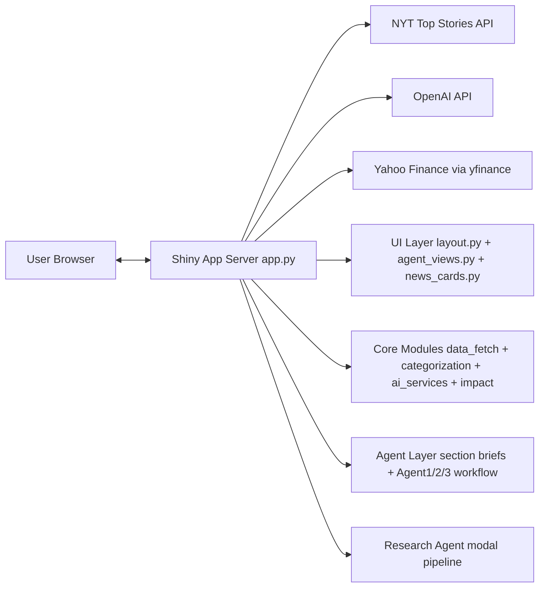
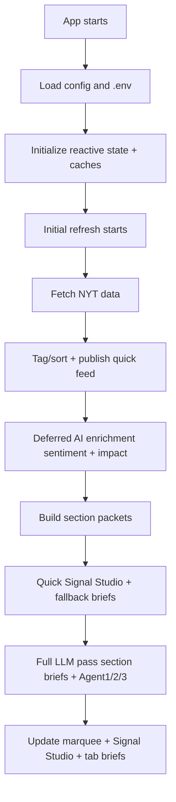

# Total Application Architecture (AppV1)

This document gives a complete, readable architecture walkthrough of the application, including:

- overall system architecture
- all core features
- process flow for each major feature
- where each feature lives in code

---

## 1) What this application is

AppV1 is a Shiny-for-Python news intelligence app that:

1. fetches live NYT stories by section,
2. classifies and ranks them (breaking, trending, latest),
3. enriches them with AI sentiment/impact/summaries,
4. runs a multi-agent workflow for cross-section insight and market validation,
5. presents results in category tabs + Signal Studio + marquee insights.

Primary entrypoint: `AppV1/app.py`.

---

## 2) High-level architecture

### Main layers

- **UI layer**: tabbed interface, filters, cards, Signal Studio, marquee.
- **Data layer**: NYT fetch, time filtering, ranking/tagging, pagination.
- **AI enrichment layer**: sentiment, impact labels, card summaries.
- **Agentic intelligence layer**: section briefs + 3-agent workflow.
- **Auxiliary research layer**: per-article deep research modal.
- **State/cache layer**: reactive state + in-memory caches for responsiveness.

---

## 3) Repository architecture (functional view)

- `AppV1/app.py`: app orchestration, reactive flow, rendering, cache usage.
- `AppV1/config.py`: environment and API key loading.
- `AppV1/modules/data_fetch.py`: NYT API fetch and short fallback cache.
- `AppV1/modules/categorization.py`: breaking/trending/latest and selection logic.
- `AppV1/modules/ai_services.py`: sentiment + summary parallel calls.
- `AppV1/modules/impact_classifier.py`: article impact classification.
- `AppV1/agents/workflow.py`: multi-agent orchestration.
- `AppV1/agents/cross_section_agent.py`: Agent 1.
- `AppV1/agents/world_sentiment_agent.py`: Agent 2.
- `AppV1/agents/market_validation_agent.py`: Agent 3 (market validation/tool path).
- `AppV1/agents/market_data.py`: market snapshot aggregation.
- `AppV1/agents/llm_client.py`: shared LLM client and tool-calling helper flow.
- `AppV1/agents/section_brief_agent.py`: parallel section brief generation.
- `AppV1/ui/layout.py`: shell/header/sidebar layout elements.
- `AppV1/ui/agent_views.py`: Signal Studio and marquee rendering.
- `AppV1/modules/news_cards.py`: card component generation.
- `AppV1/research_agent/`: optional deep-dive agent flow.
- `AppV1/www/styles.css`: UI styling.

---

## 4) End-to-end runtime process

Design goal: **show useful content quickly**, then **upgrade intelligence progressively**.

---

## 5) Core features and process for each

## Feature A: News ingestion and normalization

**What it does**  
Fetches NYT top stories from configured sections and builds a unified article table.

**Process**

1. Validate `NYT_API_KEY`.
2. Fetch sections (`home`, `business`, `arts`, `technology`, `world`, `politics`).
3. Concatenate section results.
4. Deduplicate by URL and retain source metadata.
5. Normalize timestamps to UTC.
6. If all section calls fail, optionally reuse short-lived NYT cache.

**Code**

- `AppV1/modules/data_fetch.py`
- invoked from `AppV1/app.py` refresh pipeline

---

## Feature B: Breaking/trending/latest ranking

**What it does**  
Transforms raw stories into a user-friendly priority order.

**Process**

1. Mark breaking candidates.
2. Compute trending score.
3. Sort latest.
4. First page composition logic:
   - top 2 breaking,
   - next 2 trending,
   - next 2 latest.
5. Later pages use rolling selection from unused URLs.

**Code**

- `AppV1/modules/categorization.py`
- card selection consumed in `AppV1/app.py`

---

## Feature C: Filters and pagination

**What it does**  
Lets users slice content by time, sentiment, category, and page.

**Process**

1. Time filter (`time_hours`) reduces article set.
2. Optional sentiment filter applies on top.
3. Split filtered dataset into categories.
4. Maintain per-category page state.
5. Render current 6-card page with navigation controls.

**Code**

- reactive pipeline in `AppV1/app.py`

---

## Feature D: Progressive AI enrichment (sentiment + impact)

**What it does**  
Adds AI annotations while keeping first paint fast.

**Process**

1. On refresh, publish feed with placeholder neutral labels.
2. In deferred phase, process only articles in active time window.
3. Run sentiment and impact classification concurrently.
4. Write results back to `enriched_articles_state`.
5. If time window expands later, enrich newly visible rows only.

**Code**

- `AppV1/modules/ai_services.py` (sentiment)
- `AppV1/modules/impact_classifier.py` (impact)
- orchestration in `AppV1/app.py`

---

## Feature E: AI summaries by tone

**What it does**  
Generates summary text with user-selected tone (Informational, Opinion, Analytical).

**Process**

1. Gather card title/abstract/subtitle inputs.
2. Call summary generation in parallel batches.
3. Cache by `url|tone`.
4. Render summaries into cards and section packets.
5. Lazy behavior for non-active tabs to avoid unnecessary latency.

**Code**

- `AppV1/modules/ai_services.py`
- integration in `AppV1/app.py`

---

## Feature F: Section packet builder

**What it does**  
Creates standardized section payloads used by briefs and agents.

**Packet contents**

- section id and label
- top headlines
- article summaries
- sentiment counts
- impact counts
- urls

**Process**

1. Build from time-filtered/enriched articles.
2. Take top six cards per workflow section.
3. Attach summaries and normalized counts.
4. Cache packet list with deterministic hash key.

**Code**

- `_build_agent_section_packets` in `AppV1/app.py`

---

## Feature G: Parallel section briefs

**What it does**  
Generates concise per-section narratives for each category tab.

**Process**

1. Receive section packets.
2. Run brief generation concurrently across sections.
3. Return `section -> brief` map.
4. On failures, use deterministic fallback brief text.
5. Show results in section brief panel above cards.

**Code**

- `AppV1/agents/section_brief_agent.py`
- orchestrated by `AppV1/agents/workflow.py` and `AppV1/app.py`

---

## Feature H: Multi-agent Signal Studio workflow (Agent 1 -> Agent 2 -> Agent 3)

**What it does**  
Builds a global cross-section and market-aware narrative.

**Agent roles**

- **Agent 1 (cross_section_agent)**: links themes and propagation across desks.
- **Agent 2 (world_sentiment_agent)**: computes world mood and stance from Agent 1 + section counts.
- **Agent 3 (market_validation_agent)**: validates narrative against market behavior.

**Process**

1. Trigger on refresh token / relevant control changes.
2. Publish quick deterministic workflow snapshot for immediate UI.
3. Run full pass:
   - real summaries,
   - parallel section briefs,
   - serial Agent 1 -> Agent 2 -> market snapshot -> Agent 3.
4. Update marquee text and Signal Studio panels.
5. Guard against stale async runs with run IDs.

**Code**

- orchestration: `AppV1/app.py`, `AppV1/agents/workflow.py`
- agent logic: `AppV1/agents/*.py`

---

## Feature I: Market snapshot and validation

**What it does**  
Provides market pulse and comparison context for Agent 3.

**Process**

1. Fetch selected market instruments (indices, commodities, crypto) via yfinance.
2. Compute changes and aggregate market bias.
3. Cache full-universe snapshot with TTL for efficiency.
4. Feed snapshot to workflow and Signal Studio market pulse.
5. Agent 3 may optionally request symbol-specific snapshots via tool-calling path.

**Code**

- `AppV1/agents/market_data.py`
- `AppV1/agents/market_validation_agent.py`
- `AppV1/agents/llm_client.py`

---

## Feature J: Global Insight marquee

**What it does**  
Shows rotating high-signal narrative in the header.

**Process**

1. Read `marquee_text` from agent workflow state.
2. Use workflow status to choose live/loading/fallback copy.
3. Rotate insight slides in UI.

**Code**

- state generation in `AppV1/app.py`
- UI rendering in `AppV1/ui/agent_views.py`

---

## Feature K: Research Brief ("Dive Deeper")

**What it does**  
Runs a separate deep research agent for a selected card.

**Process**

1. User clicks dive button on a card.
2. Resolve current card URL and article metadata.
3. Execute research agent in background thread.
4. Agent may call external tools (e.g., knowledge/finance lookups).
5. Show generated long-form brief in modal.
6. Store/cache result for repeated access.

**Code**

- `AppV1/research_agent/`
- modal and handlers in `AppV1/app.py`

---

## 6) State and cache architecture

### Reactive state (primary)

- `enriched_articles_state`: canonical article DataFrame.
- `section_brief_state`: per-section brief strings.
- `agent_workflow_state`: Signal Studio + marquee payload.
- `page_state`: pagination per category.
- loading/refresh flags: `is_loading`, `initial_load_done`, `last_refresh`.

### In-memory caches

- `sentiment_cache`: `url -> sentiment`
- `summary_cache`: `url|tone -> summary`
- `section_packet_cache`: packet hash -> packet list
- `agent_pipeline_cache`: hash -> final workflow payload
- NYT short cache in fetch module
- market snapshot TTL cache in market module

---

## 7) Key design patterns in this architecture

- **Progressive rendering**: first usable output appears before all AI completes.
- **Two-phase compute**: fast deterministic pass, then full LLM pass.
- **Scoped enrichment**: only classify visible-window rows when possible.
- **Parallel where safe**: section briefs and enrichment substeps run concurrently.
- **Serial where dependent**: Agent 1 -> Agent 2 -> Agent 3 chain.
- **Cache-first optimization**: avoid recomputation for unchanged inputs.
- **Fallback-first resilience**: deterministic behavior if APIs or LLM calls fail.

---

## 8) Operational dependency map

- Requires `NYT_API_KEY` for feed ingestion.
- Requires `OPENAI_API_KEY` for AI enrichment and agent intelligence.
- Uses Yahoo Finance (`yfinance`) for market snapshot.
- If dependencies degrade:
  - UI still attempts to remain functional with neutral or fallback outputs.

---

## 9) One-paragraph architecture summary

AppV1 is a layered, reactive news intelligence system: Shiny UI and state orchestration (`app.py`) sit on top of a data pipeline (NYT fetch + categorization), AI enrichment services (sentiment/impact/summaries), and an agentic intelligence stack (parallel section briefs plus serial Agent 1/2/3 market-aware workflow). The runtime intentionally uses progressive rendering and staged computation so users get immediate content and then upgraded intelligence, while caches and fallback paths keep the app responsive and resilient under API latency or transient failures.

